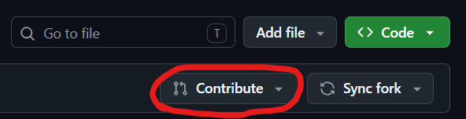
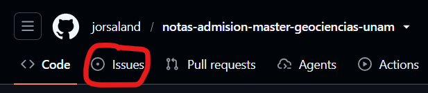

# Notas

- Este es un repositorio público con notas de estudio para los exámenes de admisión del programa de [Maestría en Ciencias de la Tierra](https://www.pctierra.unam.mx/) ofrecido por la Universidad Autónoma de México (UNAM).

- Los exámenes son los siguientes:
  - Habilidades de expresión verbal
  - Conocimientos en geociencias
  - Conocimientos en matemáticas
  - Conocimientos en física, biología o química (a elección)

- En mi caso, elegí el examen de física, así que no dejaré notas para los exámenes de biología ni química, ni tampoco para el examen de habilidades verbales. Solo dejaré el esquema de los temas para quienes quieran contribuir.

# Contribuciones

Se aceptan contribuciones a través de pull requests. Puedes hacer un fork (esquina superior derecha) para copiar el repositorio en tu cuenta.

Después de subir los cambios al repositorio de tu cuenta, puedes enviar un *pull request* con el botón `Contribute`.

¿Muy complicado? Envíame simplemente un *issue* en el panel superior con los cambios que quieres que incorpore. Puedes abrir cualquiera de los archivos de notas *Markdown* (.md) para tener una referencia del formato utilizado.

Si nunca has editado un archivo *Markdown* (.md), te recomiendo instalar [Visual Studio Code](https://code.visualstudio.com/) o utilizar alguna herramienta online. Te dejo algunas:
- https://readme.so/editor
- https://markdownlivepreview.com

**La idea es ayudarnos ^_^**