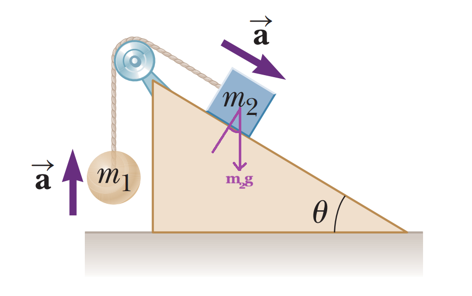

# 1. Leyes deNewton

## 1.1 Aplicación de las leyes de Newton

#### Aplicar las leyes de Newton para resolver un problema sobre dinámica.
> Las leyes de Newton son las siguientes:
> - **Primera ley de Newton:** Un cuerpo en reposo o en movimiento tiende a conservar ese estado en ausencia de fuerzas externas.
> - **Segunda ley de Newton:** La fuerza aplicada sobre un cuerpo y su aceleración están en relación directamente proporcional, siendo la masa la constante de proporcionalidad.
>
> $$ \sum F = ma $$
>
> - **Tercera ley de Newton:** La fuerza aplicada por un cuerpo A sobre un cuerpo B es igual a la fuerza aplicada por el cuerpo B sobre el cuerpo A pero en el sentido opuesto.
>
> En el siguiente ejercicio, se quiere calcular la aceleración de dos masas unidas por una cuerda tensa y una polea sin masa, sobre un plano sin fricción:
>
> 
>
> Podemos empezar por calcular las fuerzas para la masa 1. Sea $\textbf{T}$ la fuerza de tensión constante a lo largo de la cuerda. Tomando un eje que es positivo hacia arriba, tenemos:
>
> $$
> \begin{aligned}
> \sum \textbf{F}_1 = m_1 \textbf{a} \\
> \textbf{T} + m_1 \textbf{g} = m_1 \textbf{a} \\
> ||T|| - m_1 ||g|| = m_1 a \\
> ||T|| = m_1 a + m_1 ||g|| \\
> \end{aligned}
> $$
>
> Ahora, para la masa 2, podemos tomar nuestro eje paralelo a la superficie, siendo positivo hacia la derecha. En la ecuación que se obtiene, podemos remplazar el valor encontrado previamente para la tensión.
>
> $$
> \begin{aligned}
> \sum \textbf{F}_2 = m_2 \textbf{a} \\
> \textbf{T} + m_2 \textbf{g} \sin(\theta) = m_2 \textbf{a} \\
> -||T|| + m_2 ||g|| \sin(\theta) = m_2 a \\
> -(m_1 a + m_1 ||g||) + m_2 ||g|| \sin(\theta) = m_2 a \\
> -m_1 a - m_1 ||g|| + m_2 ||g|| \sin(\theta) = m_2 a \\
> -m_1 ||g|| + m_2 ||g|| \sin(\theta) = m_2 a + m_1 a \\
> ||g||(m_2 \sin(\theta) - m_1) = (m_2 + m_1) a \\
> a = \frac{m_2 \sin(\theta) - m_1}{m_2 + m_1} ||g|| \\
> \end{aligned}
> $$
>
> Notemos que $a$ no es la magnitud $||a||$. La magnitud siempre es positiva. En cambio, $a$ puede tomar valores positivos o negativos porque es la proyección del vector sobre el eje que estamos tomando en ambos sistemas de referencia. Si es positivo, quiere decir que la aceleración ocurre hacia arriba para la masa 1 y hacia la derecha (y abajo) para la masa 2. Si es negativo, indica lo contrario.

# 2. Trabajo y Energía

## 2.1 Conservación de la energía mecánica

#### Aplicar la ley de conservación de la energía mecánica en las siguientes situaciones: (1) un cuerpo en movimiento circular, (2) movimiento de un cuerpo en planos inclinados, (3) un choque elástico entre dos cuerpos.

> En un movimiento circular, podemos plantear dos casos límites: uno en el que el movimiento es solo horizontal y otro en el que tiene una componente vertical. Para cualquier caso, tenemos que si la energía se conserva, entonces la energía va a ser igual en puntos arbitrarios de la trayectoria:
>
> $$
> \begin{aligned}
> E_1 = E_2 \\
> K_1 + E_{p1} = K_2 + E_{p2} \\
> \frac{1}{2}mv_1^2 + mgh_1 = \frac{1}{2}mv_2^2 + mgh_2 \\
> \end{aligned}
> $$
>
> Para el caso horizontal, la velocidad y la altura son constantes, por lo tanto, la energía mecánica se mantiene constante.
>
> $$ E = \frac{1}{2}mv^2 + mgh $$
>
> Para el caso vertical, podemos tomar convenientemente el punto más bajo como $h=0$ y el más alto como $h=2R$, donde $R$ es el radio de la circunferencia descrita, y encontrar la relación necesaria entre las velocidades para que se conserve la energía.
>
> $$
> \begin{aligned}
> \frac{1}{2}mv_1^2 + mgh_1 = \frac{1}{2}mv_2^2 + mgh_2 \\
> \frac{1}{2}mv_1^2 + mg(0) = \frac{1}{2}mv_2^2 + mg(2R) \\
> \frac{1}{2}mv_1^2 = \frac{1}{2}mv_2^2 + 2mgR \\
> \frac{1}{2}v_1^2 = \frac{1}{2}v_2^2 + 2gR \\
> v_1^2 = v_2^2 + 4gR \\
> v_1 = \sqrt{v_2^2 + 4gR} \\
> \end{aligned}
> $$
>
> Finalmente, encontramos la relación entre la velocidad más baja y la más alta necesaria para que se conserve la energía mecánica.
>
> Para un objeto sobre un plano inclinado, se requiere que no haya fricción para que se pueda conservar la energía. Independientemente del ángulo del plano, se mantienen las mismas ecuaciones para la energía mecánica. Si tomamos $h$ como la altura del objeto en el punto más alto del plano y 0 en el punto más bajo, tenemos:
> $$
> \begin{aligned}
> \frac{1}{2}mv_1^2 + mgh_1 = \frac{1}{2}mv_2^2 + mgh_2 \\
> \frac{1}{2}mv_1^2 + mg(0) = \frac{1}{2}mv_2^2 + mg(h) \\
> \frac{1}{2}mv_1^2 = \frac{1}{2}mv_2^2 + mgh \\
> \frac{1}{2}v_1^2 = \frac{1}{2}v_2^2 + gh \\
> v_1^2 = v_2^2 + 2gh \\
> v_1 = \sqrt{v_2^2 + 2gh} \\
> \end{aligned}
> $$
>
> En un choque elástico se conserva la energía del sistema y también el momento lineal.
>
> $$
> \begin{aligned}
> \frac{1}{2}mv_{1i}^2 + \frac{1}{2}mv_{2i}^2 = \frac{1}{2}mv_{1f}^2 + \frac{1}{2}mv_{2f}^2 \\
> \textbf{p}_1i + \textbf{p}_2i = \textbf{p}_1f + \textbf{p}_2f
> \end{aligned}
> $$

# 3. Ley de la gravitación universal

## 3.1 Gravitación

#### Emplear la ley de la gravitación universal.
> - [APUNTES]

# 4. Termodinámica: temperatura, expansión térmica y gases ideales

## 4.1 Temperatura, calor y la ley cero

#### Calcular la variación de la temperatura y calor de sustancias que llegaron a un equilibrio térmico.
> - [APUNTES]

## 4.2 Gases ideales y ecuación de estado

#### Aplicar la ecuación de estado de los gases para calcular la relación entre presión, temperatura y volumen.
> - [APUNTES]

## 4.3 La primera ley de la termodinámica

#### Aplicar la primera ley de la termodinámica para calcular variaciones de energía, calor o trabajo.
> - [APUNTES]

# 5. Electricidad

## 5.1 Ley de Coulomb

#### Usar la ley de Coulomb para solucionar un problema.
> - [APUNTES]

## 5.2 Carga eléctrica y el campo eléctrico: expresión y cálculo del campo eléctrico

#### Calcular el campo eléctrico en el caso unidimensional a partir de la carga de la partícula y de la fuerza que se ejerce sobre ella.
> - [APUNTES]

## 5.3 Corriente eléctrica: Ley de Ohm

#### Aplicar la ley de Ohm en circuitos simples.
> - [APUNTES]

# 6. Magnetismo

## 6.1 Ley de Ampere

#### Resolver la ley de Ampere.
> - [APUNTES]
