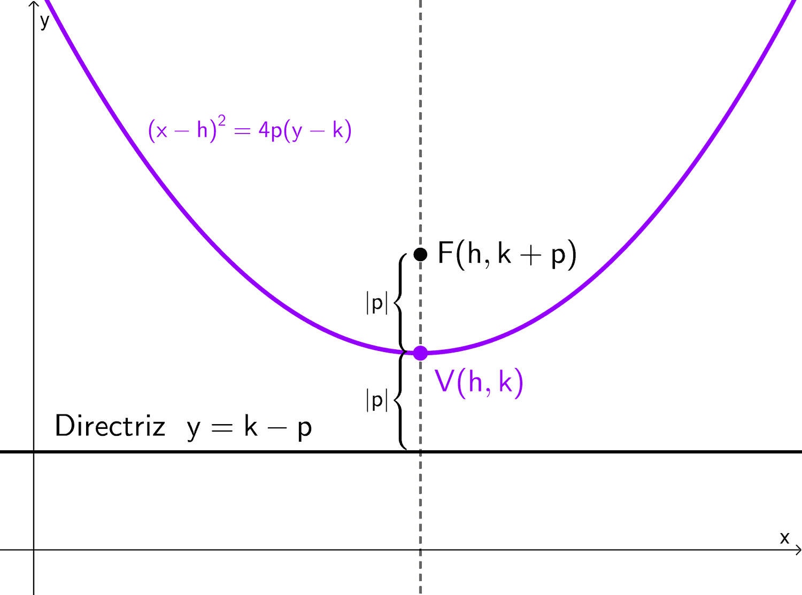
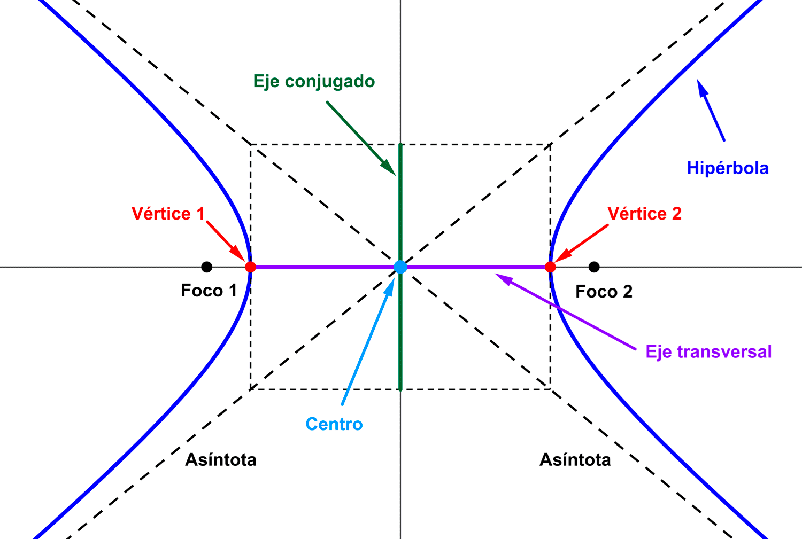
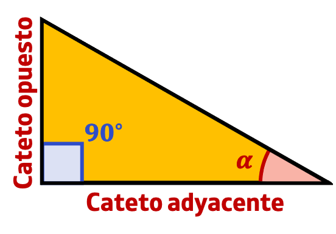
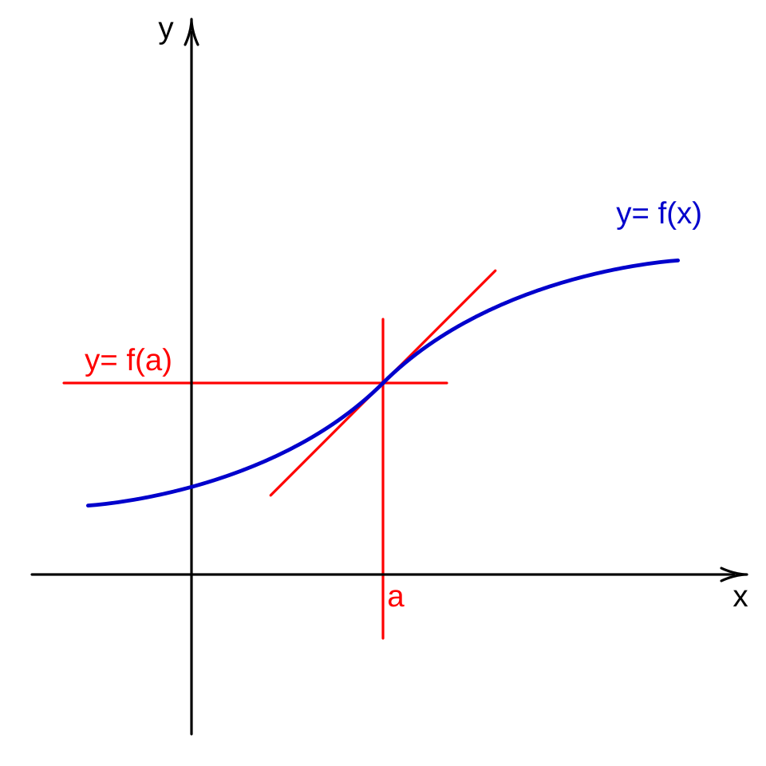
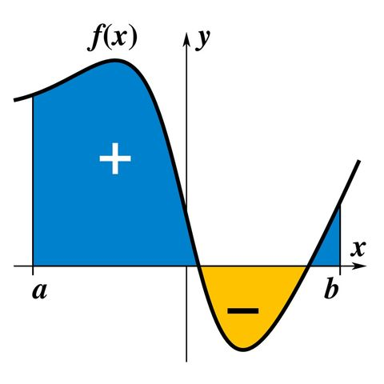
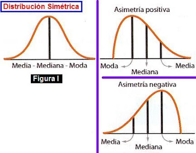
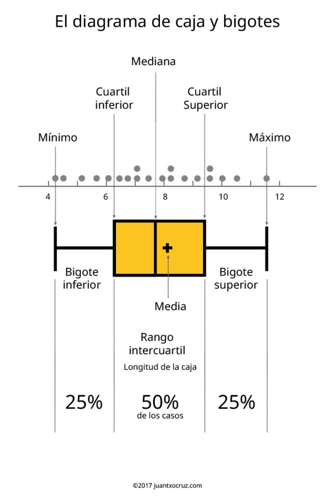

# 1. Álgebra y Geometría Analítica

## 1.1 Exponenciación, funciones logarítmicas

#### Emplear las reglas logarítmicas y las exponenciales.
> Reglas de los exponentes:
> - **Multiplicación de bases iguales:** Es igual a la base elevada a la suma de los exponentes.
>
> $$ {b^x}{b^y} = b^{x+y} $$
>
> - **División de bases iguales:** Es igual a la base elevada a la resta de los exponentes.
>
> $$ \frac{b^x}{b^y} = b^{x+y} $$
>
> - **División de bases iguales:** Es igual a la base elevada a la resta de los exponentes.
>
> $$ \frac{b^x}{b^y} = b^{x+y} $$
>
> - **Potencia de una potencia:** Es igual a la base elevada al producto de los exponentes.
>
> $$ (b^x)^{y} = b^{xy} $$
>
> - **Exponente cero:** Es igual a 1, siempre y cuando la base no sea 0.
>
> $$ b^0 = 1 $$
>
> - **Exponente negativo:** Es igual a 1 dividido entre la base con el exponente positivo (o en general, del signo opuesto).
>
> $$ b^{-x} = \frac{1}{b^x} $$
>
> Reglas de los logaritmos:
> - **Suma de bases iguales:** Es igual al logaritmo sobre la misma base de la multiplicación de los argumentos.
>
> $$ \log_b(x) + \log_b(y) = \log_b(x \cdot y) $$
>
> - **Resta de bases iguales:** Es igual al logaritmo sobre la misma base de la división de los argumentos.
>
> $$ \log_b(x) - \log_b(y) = \log_b\left(\frac{x}{y}\right) $$
>
> - **Logaritmo multiplicado por un número:** Es igual al logaritmo sobre la misma base del argumento elevado al número.
>
> $$ \log_b(x^k) = k \cdot \log_b(x) $$
>
> - **Cambio de base:** La división de logaritmos con la misma base es igual al logaritmo del argumento del numerador con base en el argumento del denominador.
>
> $$ \log_a(x) = \frac{\log_b(x)}{\log_b(a)} $$
>
> - **Logaritmo de la base:** Es igual a 1 siempre y cuando el argumento (y la base) no sea 0.
>
> $$ \log_b(b) = 1 $$
>
> - **Logaritmo de 1:** Es igual a 0 siempre y cuando la base no sea 0.
>
> $$ \log_b(1) = 0 $$

## 1.2 Ecuación de la recta

#### Obtener los parámetros que definen las ecuaciones de rectas.
> La ecuación de la recta está dada por:
>
> $$ y = mx + b $$
>
> donde $x$ y $y$ son las posiciones en los respectivos ejes, $m$ la pendiente de la recta y $b$ el punto donde la recta intercepta al eje $y$.

## 1.3 Ecuaciones de parábolas e hipérbolas

#### Obtener los parámetros que definen las ecuaciones de parábolas e hipérbolas.
> La ecuación canónica de una parábola horizontal, que abre hacia la izquierda o hacia la derecha, está dada por:
>
> $$ (y-k)^2 = 4p(x-h) $$
>
> donde $x$ y $y$ son las posiciones en los respectivos ejes, $h$ y $k$ las coordenadas del vértice y $p$ la distancia del vértice al foco.
Para una parábola vertical, que abre hacia arriba o hacia abajo, está dada por:
>
> $$ (x-h)^2 = 4p(y-k) $$
>
> 
>
> La ecuación canónica de la hipérbola está dada por:
>
> $$ \frac{(x-h)^2}{a^2} - \frac{(y-k)^2}{b^2} = 1 $$
>
> donde $x$ y $y$ son las posiciones en los respectivos ejes, $h$ y $k$ las coordenadas del centro geométrico de la hipérbola. Si dibujamos un rectángulo cuyas esquinas estén sobre las asíntotas y dos de sus lados opuestos tocando los vértices de la hipérbola, tenemos que $a$ es la distancia del centro (sobre el eje transversal) a cualquiera de los vértices y $b$ es la distancia del centro a los otros 2 lados del rectángulo (sobre el eje conjugado).
>
> 

## 1.4 Trigonometría

#### Resolver problemas de trigonometría.

> Un triángulo rectángulo tiene un ángulo de 90°. Sea $\alpha$ uno de los otros ángulos, $a$ el lado adyacente al ángulo, $b$ el lado opuesto y $h$ la hipotenusa, tenemos que se relacionan por las siguientes ecuaciones:
>
> $$ \cos(\alpha) = \frac{a}{h} $$
>
> $$ \sin(\alpha) = \frac{b}{h} $$
>
> $$ \tan(\alpha) = \frac{b}{a} $$
>
> 
>
>También tenemos la ecuación de Pitágoras que relaciona los tres lados:
>
> $$ h^2 = a^2 + b^2 $$
>
>Además, podemos aprovechar la identidad fundamental de la trigonometría:
>
> $$ \sin^2(\alpha) + \cos^2(\alpha) = 1 $$
>
> Otras identidades que pueden ser útiles son las del ángulo doble
>
> $$
> \begin{aligned}
> \sin(2\alpha) = 2 \sin^2(\alpha) \cos(\alpha) \\
> \cos(2\alpha) = \cos^2(\alpha) - \sin^2(\alpha) \\
> \tan(2\alpha) = \frac{2\tan(\alpha)}{1 - \tan^2(\alpha)} \\
> \end{aligned}
> $$

# 2. Álgebra Lineal

## 2.1 Sistemasde ecuaciones lineales

#### Resolver sistemas de ecuaciones lineales.

> **Método de sustitución:** Consiste en despejar una de las variables y luego remplazarla en la otra ecuación. También se puede aplicar en sistemas de ecuaciones lineales con más de 2 variables. Ejemplo:
>
> $$
> \begin{aligned}
> [1] \space 4x - 2y = 8 \\
> [2] \space 3x + y = 2 \\
> \end{aligned}
> $$
>
> Despejamos por ejemplo, $y$ en la ecuación 2:
>
> $$
> \begin{aligned}
> 3x + y = 2 \\
> [3] \space y = -3x + 2 \\
> \end{aligned}
> $$
>
> Ahora, podemos remplazar $y$ en la ecuación 1:
>
> $$
> \begin{aligned}
> 4x - 2y = 8 \\
> 4x - 2(-3x + 2) = 8 \\
> 4x + 6x - 4 = 8 \\
> 4x + 6x = 8 + 4 \\
> 10x = 12 \\
> x = \frac{12}{10} \\
> x = \frac{6}{5} \\
> \end{aligned}
> $$
>
> Finalmente, podemos remplazar $x$ en la ecuación 3:
>
> $$
> \begin{aligned}
> y = -3x + 2 \\
> y = -3 \left ( \frac{6}{5} \right ) + 2 \\
> y = - \frac{18}{5} + 2 \\
> y = - \frac{8}{5} \\
> \end{aligned}
> $$
>
> ---
> **Método de igualación:** Consiste en despejar la misma variable en ambas ecuaciones y luego igualarlas para despejar la otra. En sistemas de ecuaciones con más de 2 variables, hay que combinarlo con otros métodos. Ejemplo:
>
> $$
> \begin{aligned}
> [1] \space 4x - 2y = 8 \\
> [2] \space 3x + y = 2 \\
> \end{aligned}
> $$
>
> Podemos retomar la ecuación 3 del método de sustitución, calculada a partir de la ecuación 2:
>
> $$
> \begin{aligned}
> [3] \space y = -3x + 2 \\
> \end{aligned}
> $$
>
> Y ahora despejamos $y$ de la ecuación 1:
>
> $$
> \begin{aligned}
> 4x - 2y = 8 \\
> 4x = 8 + 2y \\
> 2y = 4x - 8 \\
> y = \frac{4}{2} x - \frac{8}{2} \\
> [4] \space y = 2x - 4 \\
> \end{aligned}
> $$
>
> Entonces podemos igualar las ecuaciones 3 y 4:
>
> $$
> \begin{aligned}
> -3x + 2 = 2x - 4 \\
> -3x - 2x = -4 - 2 \\
> -5x = -6 \\
> x = \frac{6}{5} \\
> \end{aligned}
> $$
>
> Y finalmente, se obtiene $y$ remplazando $x$ en cualquier ecuación como en el método de sustitución.
>
> ---
> **Método de reducción:** Consiste en multiplicar ambas ecuaciones para que al sumarlas, se pueda anular alguna de las variables. Ejemplo:
>
> $$
> \begin{aligned}
> [1] \space 4x - 2y = 8 \\
> [2] \space 3x + y = 2 \\
> \end{aligned}
> $$
> Multiplicamos la ecuación 1 por 1 y la ecuación 2 por 2, para obtener $-2y$ y $2y$.
> $$
> \begin{aligned}
> [\times 1] \space 4x - 2y = 8 \\
> [\times 2] \space 3x + y = 2 \\
> \end{aligned}
> $$
>
> $$
> \begin{aligned}
> 4x - 2y = 8 \\
> 6x + 2y = 4 \\
> \hline
> 10x + 0 = 12 \\
> \end{aligned}
> $$
>
> Finalmente, despejamos $x$ y remplazamos como en los métodos anteriores
>
> $$
> \begin{aligned}
> 10x = 12 \\
> x = \frac{12}{10} \\
> x = \frac{6}{5} \\
> \end{aligned}
> $$

## 2.2 Polinomios y ecuación cuadrática

#### Resolver polinomios cuadráticos.
> Dada una ecuación cuadrática de la forma
>
> $$ ax^2 + bx + c $$
>
> La ecuación general para solucionarla es:
> 
> $$ x = \frac{-b \pm \sqrt{b^2 - 4ac}}{2a} $$
>
>
#### Aplicar reglas de factorización para simplificar polinomios.
> - **Factor común:** Consiste en extraer la variable con menor exponente. Ejemplo:
>
> $$ 2x^2 + 4x = 2x(x+2) $$
>
> - **Diferencia de cuadrados:** Cuando un binomio consta de una resta con raíces exactas, esto es igual a multiplicar la suma de las raíces con la resta de las raíces. La fórmula general es:
>
> $$ a^2 - b^2 = (a+b)(a-b) $$
>
> **Trinomio cuadrado perfecto:** Un trinomio donde el primer y tercer término tienen raíces cuadradas exactas, y el del medio es el doble producto de ambas. La fórmula general es:
>
> $$ a^2 \pm 2ab + b^2 = (a \pm b)^2 $$

# 3. Cálculo Diferencial e Integral

## 3.1 Funciones, límites y continuidad

#### Comprender gráficamente el concepto de función.
> Una gráfica de función es la representación visual de una estructura matemática que asigna a cada valor de entrada un único valor de salida. El eje horizontal (x) muestra los valores de entrada o variable independiente. El eje vertical (y) muestra los valores de salida o variable dependiente.
>
> 

#### Calcular límites de funciones algebraicas básicas.
> Cuando no hay indeterminaciones, se pueden resolver por sustitución directa. Por ejemplo:
>
> $$
> \begin{aligned}
> f(x) = 5x \\
> \lim_{x \to 2} f(x) = \lim_{x \to 2} (5x) \\
> \lim_{x \to 2} f(x) = 5 \times 2 \\
> \lim_{x \to 2} f(x) = 10 \\
> \end{aligned}
> $$
>
> Cuando hay indeterminaciones, se debe usar alguno de los siguientes métodos:
>
> **Factorización:** Se factoriza un término que tiende a cero y se cancela con otro. Por ejemplo, el límite cuando $x$ tiende a 1 de la siguiente función se puede calcular factorizando por diferencia de cuadrados.
>
> $$
> \begin{aligned}
> f(x) = \frac{x^2 - 1}{x-1} \\
> \lim_{x \to 1} f(x) = \lim_{x \to 1} \left ( \frac{x^2 - 1}{x-1} \right ) \\
> \lim_{x \to 1} f(x) = \lim_{x \to 1} \left ( \frac{(x+1)(x-1)}{x-1} \right ) \\
> \lim_{x \to 1} f(x) = \lim_{x \to 1} (x+1) \\
> \lim_{x \to 1} f(x) = 1+1 \\
> \lim_{x \to 1} f(x) = 2 \\
> \end{aligned}
> $$
>
> **Conjugación:** Se factoriza un término que tiende a cero y se cancela con otro. Por ejemplo, el límite cuando $x$ tiende a 1 de la siguiente función se puede calcular factorizando por diferencia de cuadrados. En el siguiente ejemplo, hay una indeterminación cuando $x$ es igual a 4.
>
> $$
> \begin{aligned}
> f(x) = \frac{ \sqrt{x} - 2}{x-4} \\
> \lim_{x \to 4}f(x) = \lim_{x \to 4} \left ( \frac{ \sqrt{x} - 2}{x-4} \right ) \\
> \lim_{x \to 4}f(x) = \lim_{x \to 4} \left ( \frac{ (\sqrt{x} - 2)(\sqrt{x} + 2) }{(x-4)(\sqrt{x} + 2)} \right ) \\
> \lim_{x \to 4}f(x) = \lim_{x \to 4} \left ( \frac{ (\sqrt{x})^2 - (2)^2 }{(x-4)(\sqrt{x} + 2)} \right ) \\
> \lim_{x \to 4}f(x) = \lim_{x \to 4} \left ( \frac{x-4}{(x-4)(\sqrt{x} + 2)} \right ) \\
> \lim_{x \to 4}f(x) = \lim_{x \to 4} \left ( \frac{1}{\sqrt{x} + 2} \right ) \\
> \lim_{x \to 4}f(x) = \frac{1}{\sqrt{4} + 2} \\
> \lim_{x \to 4}f(x) = \frac{1}{4} \\
> \end{aligned}
> $$
>
> **Identidades trigonométricas:** Se aprovechan identidades trigonométricas para remplazar funciones que dan indeterminaciones. En el siguiente ejemplo, se calcula el límite cuando $x$ tiende a 0 de una función.
>
> $$
> \begin{aligned}
> f(x) = \frac{\sin(x)}{\sin(2x)} \\
> \lim_{x \to 0}f(x) = \lim_{x \to 0} \left ( \frac{\sin(x)}{\sin(2x)} \right ) \\
> \lim_{x \to 0}f(x) = \lim_{x \to 0} \left ( \frac{\sin(x)}{ 2 \sin(x) \cos(x) } \right ) \\
> \lim_{x \to 0}f(x) = \lim_{x \to 0} \left ( \frac{1}{2\cos(x)} \right ) \\
> \lim_{x \to 0}f(x) = \frac{1}{2\cos(0)} \\
> \lim_{x \to 0}f(x) = \frac{1}{2} \\
> \end{aligned}
> $$

## 3.2 Derivación

#### Calcular derivadas de funciones analíticas.
> **Derivada de una constante:** La derivada de una constante siempre es igual a 0.
>
> $$ \frac{\mathrm{d}}{\mathrm{d}x} c = 0 $$
>
> **Regla de la potencia:** La derivada de una variable elevada a una potencia se calcula con la siguiente fórmula:
> 
> $$ \frac{\mathrm{d}}{\mathrm{d}x} x^n = nx^{n-1} $$
>
> Por ejemplo:
>
> $$ \frac{\mathrm{d}}{\mathrm{d}x} x^4 = 4x^{3} $$
>
> **Derivadas de funciones trigonométricas:** Para las funciones trigonométricas básicas, tenemos:
> 
> $$
> \begin{aligned}
> \frac{\mathrm{d}}{\mathrm{d}x} \sin(x) = \cos(x) \\
> \frac{\mathrm{d}}{\mathrm{d}x} \cos(x) = - \sin(x) \\
> \frac{\mathrm{d}}{\mathrm{d}x} \tan(x) = \sec^2(x) \\
> \end{aligned}
> $$
>
> **Derivada de función exponencial:** El caso general y para $e$ están dados por:
> 
> $$
> \begin{aligned}
> \frac{\mathrm{d}}{\mathrm{d}x} a^x = a^x \ln(a) \\
> \frac{\mathrm{d}}{\mathrm{d}x} e^x = e^x \\
> \end{aligned}
> $$
>
> **Derivada de logaritmo:** El caso general y para el logaritmo natural están dados por:
> 
> $$
> \begin{aligned}
> \frac{\mathrm{d}}{\mathrm{d}x} \log_b(x) = \frac{1}{x \ln(a)} \\
> \frac{\mathrm{d}}{\mathrm{d}x} \ln(x) = \frac{1}{x} \\
> \end{aligned}
> $$
>
> **Operaciones de derivadas:** Los siguientes casos ilustran las equivalencias entre derivadas compuestas:
> 
> - Suma de funciones:
>
> $$
> \begin{aligned}
> f(x) = u+v \\
> f'(x) = u'+v' \\
> \end{aligned}
> $$
>
> - Multiplicación por una constante
>
> $$
> \begin{aligned}
> f(x) = cu \\
> f'(x) = cu' \\
> \end{aligned}
> $$
>
> - Multiplicación de funciones (regla del producto)
>
> $$
> \begin{aligned}
> f(x) = uv \\
> f'(x) = u'v + uv' \\
> \end{aligned}
> $$
>
> - División de funciones (regla del cociente)
>
> $$
> \begin{aligned}
> f(x) = \frac{u}{v} \\
> f'(x) = \frac{u'v - uv'}{v^2} \\
> \end{aligned}
> $$
>
> **Regla de la cadena:** 
>
> $$
> \begin{aligned}
> f(x) = g(h(x)) \\
> f'(x) = g'(h(x)) \times h'(x) \\
> \end{aligned}
> $$
>
> Por ejemplo:
>
> $$ f(x) = \sin(x^3) $$
>
> Aquí tenemos que:
>
> $$
> \begin{aligned}
> g(u) = \sin(u) \\
> h(x) = x^3 \\
> \end{aligned}
> $$
>
> Luego:
>
> $$
> \begin{aligned}
> g'(u) = \cos(u) \\
> h'(x) = 3x^2 \\
> f'(x) = \cos(x^3) \times 3x^2 \\
> f'(x) = 3x^2 \cos(x^3) \\
> \end{aligned}
> $$

## 3.3 Máximos y mínimos

#### Calcular máximos y mínimos de una función.
> Para calcular los máximos y mínimos de una función, hay que sacar la primera derivada y encontrar los puntos donde esta es igual a cero. Luego, sacar la segunda derivada y evaluarla en esos mismos puntos. Si la segunda derivada es positiva, es un mínimo. Si es negativa, es un máximo. Si es 0, el criterio no es suficiente. Por ejemplo, para la siguiente función, calculamos la primera derivada:
>
> $$
> \begin{aligned}
> f(x) = x^3 - 3x + 2 \\
> f'(x) = 3x^2 - 3 \\
> \end{aligned}
> $$
>
> Al igualarla a cero, obtenemos los valores de $x$ donde hay puntos mínimos y máximos:
>
> $$
> \begin{aligned}
> 0 = 3x^2 - 3 \\
> 3x^2 = 3 \\
> x^2 = \frac{3}{3} \\
> x^2 = 1 \\
> x_1 = 1; x_2 = -1
> \end{aligned}
> $$
>
> Así, encontramos 2 puntos. A partir de la segunda derivada, evaluada en esos puntos podemos saber si son máximos o mínimos.
>
> $$
> \begin{aligned}
> f'(x) = 3x^2 - 3 \\
> f''(x) = 6x \\
> f''(1) = 6 \\
> f''(-1) = -6 \\
> \end{aligned}
> $$
>
> Así, encontramos que en $x=1$ hay un punto mínimo y en $x=-1$ hay un punto máximo

## 3.4 Integración

#### Calcular integrales de funciones analíticas.
> A todas las integrales indefinidas se les agrega al final una constante arbitraria $C$.
>
> **Integral de una constante:** La integral de una constante es igual a la constante por la variable integradora.
>
> $$ \int c \mathrm{d}x = cx+C $$
>
> **Regla de la potencia:** Se calcula de forma opuesta a la derivada:
> 
> $$ \int x^{n} \mathrm{d}x = \frac{x^{n+1}}{n+1} + C  $$
>
> Para el caso especial en el que $n=-1$, tenemos:
>
> $$ \int \frac{1}{x} \mathrm{d}x = \ln|x| + C  $$
>
> **Seno, coseno y $e^x$:** Salen automáticamente a partir de las derivadas.
>
> $$
> \begin{aligned}
> \int \sin(x) \mathrm{d}x = - \cos(x) + C \\
> \int \cos(x) \mathrm{d}x = \sin(x) + C \\
> \int e^x \mathrm{d}x = e^x + C \\
> \end{aligned}
> $$
>
> **Sustitución de variable:**
> Es el proceso inverso a la regla de la cadena en las derivadas. Si dentro de la integral es visible una función y también su derivada multiplicando a $\mathrm{d}x$, entonces se puede utilizar. Por ejemplo:
>
> $$ \int 2x e^{x^2} \mathrm{d}x $$
>
> La derivada de $x^2$ está visible ($2x$) y multiplica a $\mathrm{d}x$. Entonces tenemos:
>
> $$
> \begin{aligned}
> u = x^2 \\
> \mathrm{d}u = 2x \mathrm{d}x \\
> \int 2x e^{x^2} \mathrm{d}x = \int e^u \mathrm{d}u \\
> \int 2x e^{x^2} \mathrm{d}x = e^u + C \\
> \int 2x e^{x^2} \mathrm{d}x = e^{x^2} + C \\
> \end{aligned}
> $$
>
> **Integración por partes:** Es el opuesto a la regla del producto de las derivadas. Regla mnemotécnica: "un día vi una vaca [menos flaca] vestida de uniforme".
>
> $$ \int u \mathrm{d}v = uv - \int v \mathrm{d}u $$
>
> Un ejemplo de uso es la siguiente integral:
>
> $$ \int x e^x \mathrm{d}x $$
>
> Podemos partir de lo siguiente:
>
> $$
> \begin{aligned}
> u = x \\
> \mathrm{d}v = e^x \mathrm{d}x \\
> \end{aligned}
> $$
>
> Ahora, derivamos $u$ para obtener $\mathrm{d}u$ e integramos $\mathrm{d}v$ para obtener $v$:
>
> $$
> \begin{aligned}
> u = x \\
> \mathrm{d}u = \mathrm{d}x \\
> \mathrm{d}v = e^x \mathrm{d}x \\
> \int \mathrm{d}v = \int e^x \mathrm{d}x \\
> v = e^x \\
> \end{aligned}
> $$
>
> Podemos omitir la constante de integración por ahora, para agregarla al final. Remplazamos y obtenemos:
>
> $$
> \begin{aligned}
> \int u \mathrm{d}v = uv - \int v \mathrm{d}u \\
> \int (x) (e^x \mathrm{d}x) = (x) (e^x) - \int (e^x) (\mathrm{d}x) \\
> \int x e^x \mathrm{d}x = x e^x - \int e^x \mathrm{d}x \\
> \int x e^x \mathrm{d}x = x e^x - e^x + C \\
> \int x e^x \mathrm{d}x = (x-1) e^x + C \\
> \end{aligned}
> $$
>
> **Fracciones parciales:** Consiste en separar una fracción polinómica en una suma de fracciones más simples, para integrarlas por separado y luego sumarlas.
>
> $$ \int \frac{5x - 3}{x^2 - 2x - 3} \mathrm{d}x $$
>
> Factorizamos el denominador encontrando las raíces:
>
> $$
> \begin{aligned}
> x = \frac{-b \pm \sqrt{b^2 - 4ac}}{2a} \\
> x = \frac{-(-2) \pm \sqrt{(-2)^2 - 4(1)(-3)}}{2(1)} \\
> x = \frac{2 \pm \sqrt{4+12}}{2} \\
> x = \frac{2 \pm \sqrt{16}}{2} \\
> x = \frac{2 \pm 4}{2} \\
> x = 1 \pm 2 \\
> x_1 = 3; x_2 = -1 \\
> \end{aligned}
> $$
>
> Tenemos entonces:
>
> $$ x^2 - 2x - 3 = (x-(3))(x-(-1)) $$
> $$ x^2 - 2x - 3 = (x-3)(x+1) $$
>
> Sustituimos en la función:
>
> $$ \int \frac{5x-3}{x^2 - 2x -3} \mathrm{d}x = \int \frac{5x-3}{(x-3)(x+1)} \mathrm{d}x $$
>
> Igualamos entonces a las fracciones parciales con numeradores $A$ y $B$:
>
> $$
> \begin{aligned}
> \frac{5x-3}{(x-3)(x+1)} = \frac{A}{(x-3)} + \frac{B}{(x+1)} \\\\
> \frac{(5x-3)(x-3)(x+1)}{(x-3)(x+1)} = \frac{A(x-3)(x+1)}{(x-3)} + \frac{B(x-3)(x+1)}{(x+1)} \\\\
> 5x-3 = A(x+1) + B(x-3) \\
> \end{aligned}
> $$
>
> Podemos evaluar en $x$ con valores que anulen alguna de las constantes a hallar.
>
> $$
> \begin{aligned}
> 5x-3 = A(x+1) + B(x-3) \\
> 5(-1)-3 = A((-1)+1) + B((-1)-3) \\
> -5-3 = A(-1+1) + B(-1-3) \\
> -8 = -4B \\
> B = 2 \\
> 5(3)-3 = A((3)+1) + B((3)-3) \\
> 15-3 = A(3+1) + B(3-3) \\
> 12 = 4A \\
> A = 3 \\
> \end{aligned}
> $$
>
> Remplazamos y obtenemos:
>
> $$
> \begin{aligned}
> \int \frac{5x-3}{x^2 - 2x -3} \mathrm{d}x = \int \frac{5x-3}{(x-3)(x+1)} \mathrm{d}x \\\\
> \int \frac{5x-3}{x^2 - 2x -3} \mathrm{d}x = \int \frac{A}{(x-3)} + \frac{B}{(x+1)} \mathrm{d}x \\\\
> \int \frac{5x-3}{x^2 - 2x -3} \mathrm{d}x = \int \frac{3}{(x-3)} \mathrm{d}x + \int \frac{2}{(x+1)} \mathrm{d}x \\\\
> \int \frac{5x-3}{x^2 - 2x -3} \mathrm{d}x = 3 \ln|x-3| + 2 \ln|x+1| + C \\\\
> \end{aligned}
> $$

#### Interpretar la representación geométrica de la integral.
> Geométricamente, una integral definida entre dos puntos $a$ y $b$, representa el área bajo la curva. Siendo el área positiva donde $y$ es positivo, y negativa donde $y$ es negativa. En el siguiente ejemplo, se ilustra el área bajo la curva de una integral definida de la forma:
>
> $$ \int_a^b f(x) \mathrm{d}x $$
>
> 

# 4. Probabilidad y Estadística

## 4.1 Probabilidad

#### Aplicar las reglas básicas de la probabilidad.
> - **Regla de la probabilidad total:** La probabilidad de cualquier evento siempre está entre 0 y 1
>
> $$ 0 \leq P(A) \leq  1 $$
>
> - **Regla del complemento:** El complemento es la probabilidad de ocurrencia del evento contrario y es:
>
> $$ P(A') = 1 - P(A) $$
>
> - **Regla de la suma de eventos mutuamente excluyentes:** Cuando dos eventos son mutuamente excluyentes, es decir, ocurre uno o el otro pero no ambos, la probabilidad de que ocurra uno o el otro es la suma de sus probabilidades individuales:
>
> $$ P(AoB) = P(A) + P(B) $$
>
> - **Regla de la suma de eventos no mutuamente excluyentes:** Cuando dos eventos no son mutuamente excluyentes, es decir, pueden ocurrir ambos al tiempo, la probabilidad de que ocurra uno o el otro es la suma de sus probabilidades individuales menos la suma de que ocurran ambos al tiempo:
>
> $$ P(AoB) = P(A) + P(B) - P(AyB) $$
>
> - **Regla de la multiplicación de eventos independientes:** Cuando dos eventos son independientes, es decir, la ocurrencia de uno no afecta a la del otro, la probabilidad de que ocurran ambos es el producto de sus probabilidades individuales:
>
> $$ P(AyB) = P(A) \times P(B) $$
>
> - **Regla de la multiplicación de eventos dependientes:** Cuando dos eventos son dependientes, es decir, la ocurrencia de uno afecta a la del otro, la probabilidad de que ocurran ambos es el producto de la probabilidad de que ocurra el evento independiente por la probabilidad de que ocurra el dependiente dado que el independiente haya ocurrido:
>
> $$ P(AyB) = P(A) \times P(B|A) $$
>

## 4.2 Distribuciones de probabilidad

#### Comprender las relaciones entre moda, mediana y media, dada una función de distribución de probabilidad.
> - En una distribución simétrica como lo es la distribución normal, la media, mediana y moda coinciden. Pues el punto más alto (moda) es también el punto que divide en 2 la gráfica (mediana) y a la vez el valor medio (media).
> - En una distrubicón con asimetría positiva (con el bulto desplazado hacia la izquierda), la moda es la menor, y la media es la mayor, ya que es muy sensible a los valores extremos.
> - En una distrubición con asimetría negativa (con el bulto desplazado hacia la derechoa), la moda es la mayor y la media es la menor.
>
> 

## 4.3 Medidas de tendencia central y dispersión

#### Interpretar el concepto de varianza, diagrama de Tukey (caja y bigotes) e intervalos de confianza.
> **Varianza:** es una medida que calcula qué tan dispersos están los datos alrededor de la media aritmética. Mide la distancia de cada dato respecto a la media, eleva esas diferencias al cuadrado (para evitar que los valores negativos y positivos se anulen entre sí) y calcula un promedio de esos cuadrados. Un valor de varianza cercano a cero indica que los datos son muy parecidos y están muy concentrados cerca de la media. Una varianza grande indica que los datos son muy dispersos.
>
> $$ \sigma^2 = \frac{\sum_{i=1}^N(x_i - \mu)^2}{N} $$
>
> **Diagrama de caja y bigotes o diagrama de Tukey:** Es un diagrama que resume visualmente la posición, la dispersión y la simetría de un conjunto de datos. La línea dentro de la caja representa la media. Sus límites representan los cuartiles 1 y 3 (que contienen el 25% y 75% de los datos). Los bigotes marcan los valores mínimo y máximo dentro de un rango razonable. Pueden quedar valores extremos y atípicos por fuera de este rango.
>
> 
>
> Un intervalo de confianza es un rango de valores, calculado a partir de una muestra, que tiene una alta probabilidad (por ejemplo, 95%) de contener el valor de un parámetro para cualquier miembro de toda la población. Por ejemplo, el 95% de una población puede tener una altura entre 1,6 y 1,7 m.

## 4.4 Regresión lineal simple y Correlación

#### Reconocer la diferencia entre regresión y correlación.
> **Correlación:** mide qué tan relacionadas están dos variables linealmente. Es decir, qué tanto se ajustan a una recta. El coeficiente de correlación de Pearson se puede calcular obteniendo primero los promedios de ambas variables ($\bar{x}$ y $\bar{y}$) y después para cada par de datos, calcular la siguiente ecuación:
>
> $$ r = \frac{\sum (x_i - \bar{x})(y_i - \bar{y})}{\sqrt{\sum (x_i - \bar{x})^2 \sum (y_i - \bar{y})^2}} $$
>
> Esta ecuación da un valor entre -1 y 1. Entre más cercano a 1, más positiva es la correlación. Es decir, el aumento en una variable se corresponde con un aumento en la otra. Un coeficiente cercano a -1 indica lo contrario: el aumento de una variable se corresponde con una disminución en la otra. Y un coeficiente cercano a 0 indica que los datos no están correlacionados.
>
> **Regresión:** Es una herramienta para obtener el valor de una variable a partir de otra fuertemente correlacionada. En el caso de la regresión lineal se calcula la ecuación de la recta que relaciona ambas variables, siendo la variable independiente ($X$) la que es conocida y la dependiente ($Y$) la que se quiere hallar.
>
> $$
> \begin{aligned}
> Y = a + bX \\\\
> a = \frac{\sum Y - b \sum X}{n} \\\\
> b = \frac{n \sum XY - \left(\sum X\right)\left(\sum Y\right)}{n \sum X^2 - \left(\sum X\right)^2} \\
> \end{aligned}
> $$

#### Interpretar la significancia estadística de una línea de regresión.
> La significancia estadística se mide mediante el **p-valor**, que mide qué tan probable es que un parámetro estadístico sea cierto. Se define una hipótesis nula ($H_0$) que asume que no existe una correlación lineal entre las variables. Un p-valor bajo ($\leq 0.05$) indica que hay baja probabilidad de que el resultado obtenido de correlación lineal se deba al azar. En este caso, el resultado se considera estadísticamente significativo y permite rechazar la hipótesis nula. Un p-valor ($\geq 0.05$) indica que los datos no son lo suficientemente extraños como para descartar que sean producto de la casualidad, en cuyo caso no se rechaza la hipótesis nula.